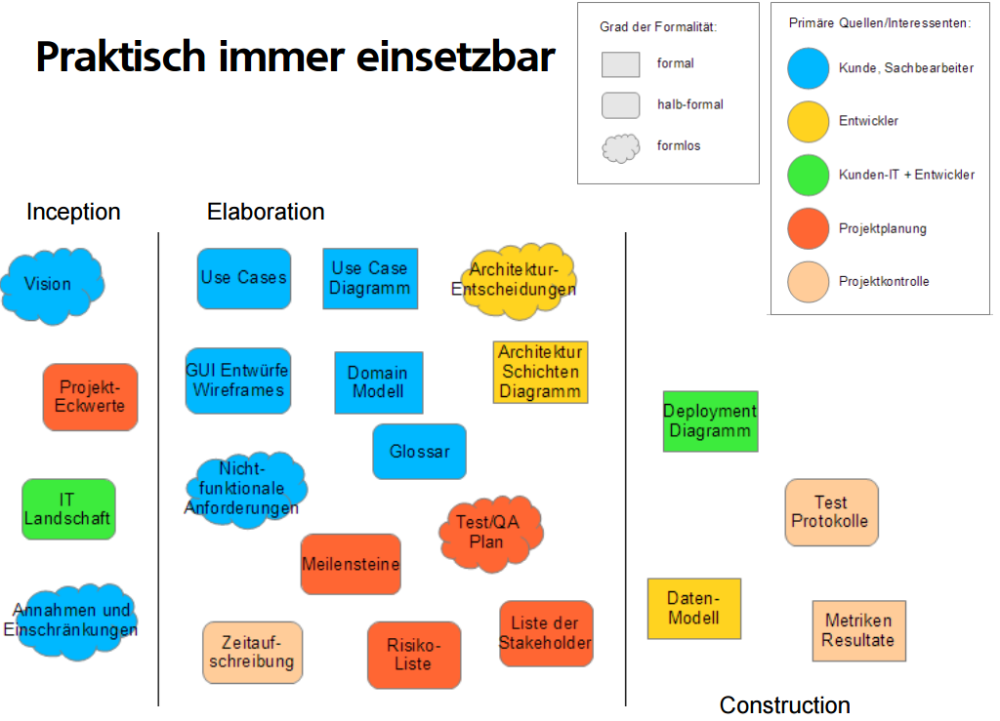
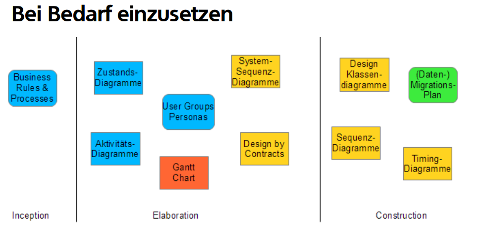

# Project Planning

## Project Management Method

1. Agile (eg. Scrum)
2. Iterative (eg. RUP - Rational Unified Process)

### RUP

4 phases & x Iterations

1. Inception
2. Elaboration
3. Construction
4. Transition

**Milestone**

#### Checklist - End of Elaboration

- [ ] Requirements: Did we understand our clients?
    - [ ] Use cases
    - [ ] Domain model
    - [ ] Non-functional requirements
- [ ] User Interface Design
    - [ ] Wireframes (eg. Balsamiq)
    - [ ] If possible, navigational/clickable prototypes - screenflows (eg. InVision, Axure)
    - [ ] High-fidelity design drafts (color theme, fonts etc.)
- [ ] Software Architecture
    - [ ] Subsystems (Deployment Diagram)
    - [ ] Interfaces & Layers are defined
        - [ ] Class Diagram
        - [ ] Component Diagram
- [ ] Development Environment, tools and methods
    - [ ] IDE
    - [ ] Version control system
    - [ ] build server
    - [ ] Unit Testing
    - [ ] Code analysis tools
    - [ ] DEV-Test-Prod Server setup
    - [ ] User stories (incl. time estimations) & Bug tracking (eg. Redmine, Jira)

#### From Use Case to work package (WP)

**Use case**
- specified from user's point of view; should be easy to communicate with clients
- describe functionalities (eg. why, what in which order and how often)
- in brief, casual or fully-dressed format

**A work package** contains
- ID, title
- Short description
- Aceptance criteria
- Time estimations
- actual hours of work
- Priority
- Status (open, in progress, to test, done)
- Category (Epic)

*Recommendations:*
- Maximum 8 hours for a work package
- Allocate only as many work packages as it fits into an iteration. 

*Rule*
- Developer estimates the time for a work package
- Client prioritises the work packages.
> **Not vice-versa!!**

## Diagrams

Diagrams are often better than words.
Furthermore, diagrams should be easy to communicate.

## Documents

| # | Product | Project |
|---| ------|-----------|
| Planning / Target |"Client wants that" => Requirements (SRS) | "we proceed so" => Project planning
| Actual | "we build so" => Software architecture (SAD) | "we are here at the moment" => Project tracing

* SRS = Software Requirements Specification
* SAD = Software Architecture Document

In addition to that:
- Work packages / backlog
- Issue/Bug tracking
- Impediments
- Build results

>>> These are changing continuously during the project. At the end, they all should be done/cleared.

*Rule*
- As early and as formal as possible -> Data model, Activity diagram, State diagram
- As early and as thoroughly as possible --> Use cases brief, clickable prototypes (screenflow)

