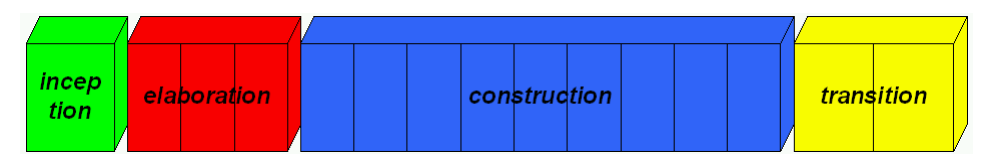
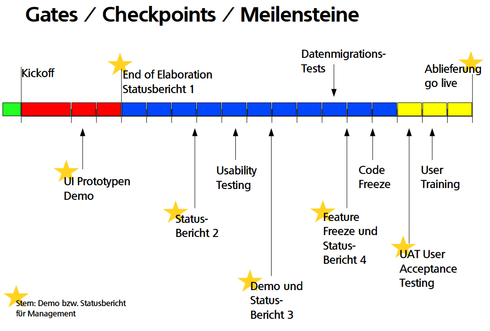

# Project Planning

## Project Management Method

1. Agile (eg. Scrum)
2. Iterative (eg. RUP - Rational Unified Process)

### RUP

4 phases & x Iterations

1. Inception
2. Elaboration
3. Construction
4. Transition

**Milestone**

#### Checklist - End of Elaboration

- [ ] Requirements: Did we understand our clients?
    - [ ] Use cases
    - [ ] Domain model
    - [ ] Non-functional requirements
- [ ] User Interface Design
    - [ ] Wireframes (eg. Balsamiq)
    - [ ] If possible, navigational/clickable prototypes - screenflows (eg. InVision, Axure)
    - [ ] High-fidelity design drafts (color theme, fonts etc.)
- [ ] Software Architecture
    - [ ] Subsystems (Deployment Diagram)
    - [ ] Interfaces & Layers are defined
        - [ ] Class Diagram
        - [ ] Component Diagram
- [ ] Development Environment, tools and methods
    - [ ] IDE
    - [ ] Version control system
    - [ ] build server
    - [ ] Unit Testing
    - [ ] Code analysis tools
    - [ ] DEV-Test-Prod Server setup
    - [ ] User stories (incl. time estimations) & Bug tracking (eg. Redmine, Jira)

